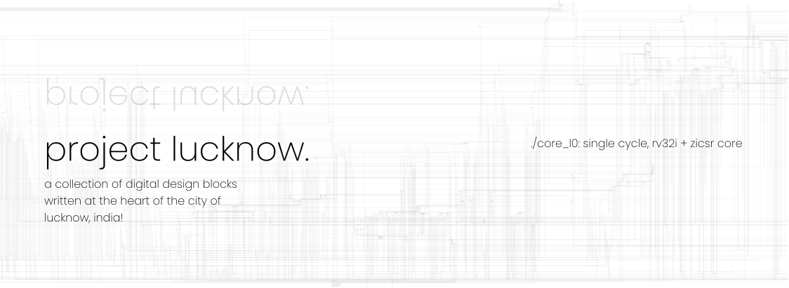

### lucknow.
"lucknow." is an open-source project where i'll publish a collection of
digital designs i've created at the heart of the city of lucknow, india!

### packages.
- ./core l0
  - 32-bit, single-cycle, compute core
  - rv32i + zicsr
  - all code executes in machine mode (m-mode)
  - can be used as a design block in larger designs where a minimal central control unit is needed
  - educational purpose

### icarus processing.
> the following requires tools available in the
> [oss-cad-suite](https://github.com/YosysHQ/oss-cad-suite-build?tab=readme-ov-file#installation)

```bash
cd ./core_l0

# single module compilation (for example: alu.sv)
iverilog -g2012 -o ./tests/results/test_alu.out ./src/shared.sv ./src/alu.sv ./tests/test_alu.sv
vvp ./tests/results/test_alu.out # generates a ./tests/results/test_alu.vcd file for gtkwave visualization

# top module compilation (for example: control.sv)
iverilog -g2012 -o ./tests/results/test_control.out -c compile.f # compile.f ensures order of compilation is maintained
vvp ./tests/results/test_control.out # generates a ./tests/results/test_control.vcd file for gtkwave visualization
```

### yosys processing.
```bash
cd ./core_l0

# start yosys
yosys

# inside yosys terminal
read -sv ./src/*.sv
hierarchy -check -top control
proc # convert design to strcutural repr.

# visualization processing
write_json ./arch/design.json # write a json netlist (processing by other tools)
show -format dot -prefix ./arch/design # write a dot for graphviz
```

### visualization.
```bash
cd ./core_l0
# if you've generated the dot file, you can visualize it with graphviz
dot -Tsvg ./arch/design.dot -o ./arch/design_dot.svg

# if you've generated a json file, i suggest you to use the pp_json.py
# first to simplify the module naming before using it with other visualization tools
python pp_json.py -i ./arch/design.json -o ./arch/pp_design.json
netlistsvg ./arch/pp_design.json -o ./design.svg # example of json netlist usage with another visualization tool
```

### license.

       ╱|、
     (˚ˎ 。7
      |、˜〵
     じしˍ,)ノ

the repository and everything within is licensed under the [GNU General Public License v3.0](https://www.gnu.org/licenses/gpl-3.0.en.html).
Refer to [COPYING.md](./COPYING.md) for the full license text.
